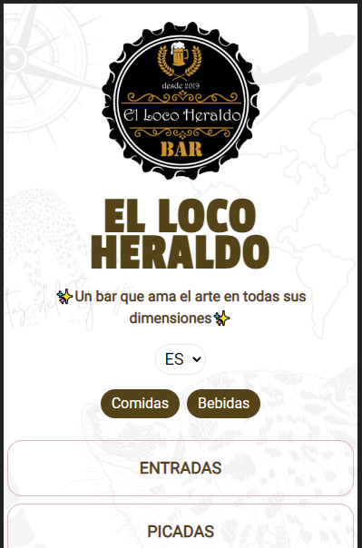

# Loco Heraldo Website

This is a freelance project developed for a local company.

**Link to project:** 

[locoheraldo.vercel.app](https://locoheraldo.vercel.app/)

## Tools I used for this project:

- ReactJS
- Next.js
- i18n Routing featured on [Next.js](https://nextjs.org/docs/advanced-features/i18n-routing)
- TailwindCSS
- Deployed on [Vercel](https://vercel.com/)

## Optimizations

- I want to add in a futured a database for updating the values as easy as possible. It could go from using a Google Sheets form, to a Firebase realtime database to make it easy.
- Add small animations and transitions

## Continuous learning

It was required for this project that the website supports both english and spanish translation, so I took advantage of i18n features in NextJS to make changing languages fast and smooth. This also taught me more on how to shape the frontend design as I want with TailwindCSS which is a strong tool to use on any project.
